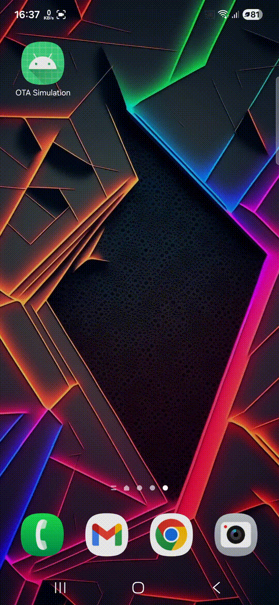

# 📱 Simple OTA Simulation

A simple Android application demonstrating **Over-The-Air (OTA) update** by downloading an APK directly from **GitHub Releases** and installing it using Android’s native package installer.

---

## 🎬 Demo

  

---

## 📦 Download Demo APK

You can try demo APK here(make sure to use v1.0):

👉 **[Download APK from GitHub Releases](https://github.com/nicolasjuniar/simple-ota-android-simulaltion/releases/latest)**

---

## 🧭 How to Test OTA Update (Step by Step)

1. Install **v1.0** of the app on your Android device
2. Open the app
3. Tap **"Update App"** button
4. Allow **Install Unknown Apps** permission (Android 8+)
5. App downloads the new APK from GitHub Release
6. Android system automatically shows the **install update popup**
7. Tap **Install** → Update completed ✅

---
